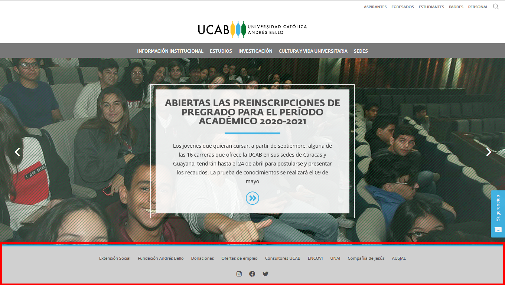
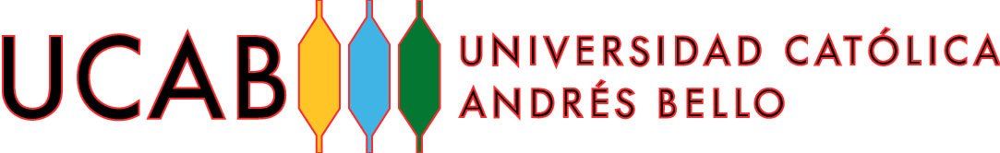

# Tabla de contenidos

- [1. Introducción](#1-introducción)
- [2. ¿A quién va dirigido?](#2-a-quién-va-dirigido)
- [3. Protocolo de solicitud sitios web](#3-protocolo-de-solicitud-sitios-web)
- [4. Jerarquía de sitios web](#4-jerarquía-de-sitios-web)
  - [4.1. Sitios de primer nivel](#41-sitios-de-primer-nivel)
  - [4.2. Sitios de segundo nivel](#42-sitios-de-segundo-nivel)
  - [4.3. Sitios de tercer nivel](#43-sitios-de-tercer-nivel)
- [5. Estructura](#5-estructura)
  - [5.1. Cabecera o header](#51-cabecera-o-header)
  - [5.2. Pie de página o footer](#52-pie-de-página-o-footer)
  - [5.3. Layouts](#53-layouts)
  - [5.4. Menús](#54-menús)
  - [5.5. Buscador](#55-buscador)
- [6. Logotipo (normativas de uso y comportamiento dentro del Tema UCAB)](#6-logotipo-normativas-de-uso-y-comportamiento-dentro-del-tema-ucab)
  - [6.1. Consideraciones iniciales](#61-consideraciones-iniciales).
  - [6.2. Formatos permitidos del logo UCAB dentro de las páginas web](#62-formatos-permitidos-del-logo-ucab-dentro-de-las-páginas-web)
  - [6.3. Comportamiento del logotipo simplificado al recorrer la página hacia abajo (scrolldown)](#63-comportamiento-del-logotipo-simplificado-al-recorrer-la-página-hacia-abajo-scrolldown)
  - [6.4. Normas para la disposición de logos de acuerdo a la jerarquía de sitios](#64-normas-para-la-disposición-de-logos-de-acuerdo-a-la-jerarquía-de-sitios)
- [7. Colores UCAB (uso de la Paleta 2020 y Sistema de Marcas)](#7-colores-ucab-uso-de-la-paleta-2020-y-sistema-de-marcas)
  - [7.1. Paleta UCAB (principal)](#71-paleta-ucab-principal)
  - [7.2. Paleta UCAB 2020 (secundaria)](#72-paleta-ucab-2020-secundaria)
  - [7.3. Paleta escala de grises UCAB](#73-paleta-escala-de-grises-ucab)
  - [7.4. Paleta Sistema de Marcas UCAB](#74-paleta-sistema-de-marcas-ucab)
- [8. Tipografías (uso normativo)](#8-tipografías-uso-normativo)
  - [8.1. Familia Fedra Sans (tipografía del Tema UCAB)](#81-familia-fedra-sans-tipografía-del-tema-ucab)
  - [8.2. Familia Open Sans](#82-familia-open-sans)
  - [8.3. Familia Source Sans Pro](#83-familia-source-sans-pro)
- [9. Componentes UCAB](#9-componentes-ucab)
  - [9.1. Componentes regulares](#91-componentes-regulares)
  - [9.2. Componentes de anchura completa](#92-componentes-de-anchura-completa)
- [10. Manejo de imágenes dentro del sitio web (sitio de primer nivel y sitios de segundo nivel)](#10-manejo-de-imágenes-dentro-del-sitio-web-sitio-de-primer-nivel-y-sitios-de-segundo-nivel)
  - [10.1. Consideraciones iniciales](#101-consideraciones-iniciales)
  - [10.2. Especificaciones para uso de imágenes en los componentes del Tema UCAB](#102-especificaciones-para-uso-de-imágenes-en-los-componentes-del-tema-ucab)

# 1. Introducción

El presente documento está elaborado con la finalidad de ser una guía que oriente los desarrollos enmarcados dentro del **Proyecto web UCAB**, tanto en su fase de desarrollo como en el mantenimiento cotidiano de las páginas. Los usuarios e interesados en iniciar sitios web contarán con una serie de instrucciones y pasos normativos que van alineados con las tecnologías desarrolladas, la línea gráfica y editorial; pautas que son inherentes a la UCAB en sus plataformas digitales.
Dentro de los lineamientos que se desarrollarán en este manual, se explican:

- Protocolos de solicitud para el desarrollo de sitios web en la UCAB.
- Tecnologías y plataformas de desarrollo utilizadas.
- Estructura de los sitios web UCAB
- Usos correctos de logotipos dentro de las páginas web UCAB.
- Paleta 2020 (Colores autorizados para el uso dentro de los sitios web UCAB)
- Tipografías
- Catálogo de componentes web desarrollados para el **Tema UCAB**.
- Normas para la línea Editorial de los sitios web UCAB.

> Ante cualquier duda, sugerencia o solicitud, contacte a los miembros del equipo de la **Unidad Web** a través de las siguientes coordenadas:

## Dirección General de Comunicación, Mercadeo y Promoción

## Unidad Web

- **Director:** Leda Piñero

  - **Correo Electrónico:** [lpinero@ucab.edu.ve](mailto:lpinero@ucab.edu.ve)
  
  
- **Analista Web**

  - **Madeline Rodríguez**

    - **Correo Electrónico:** [madrodri@ucab.edu.ve](mailto:madrodri@ucab.edu.ve)
   

# 2. ¿A quién va dirigido?

El presente material pretende atender las necesidades informativas de los interesados y colaboradores que deseen iniciar y mantener sus respectivos sitios web dentro de la UCAB. Este target está compuesto por:

- Dependencias que integran la UCAB.
- Desarrolladores web.
- Diseñadores gráficos y web.

> Ante cualquier duda, sugerencia o solicitud, contacte a los miembros del equipo de la **Unidad Web**.

# 3. Protocolo de solicitud sitios web

Pasos para la solicitud de desarrollo de sitios web:

1. Comunicación con el equipo de la Unidad Web vía correo electrónico comunicando requerimientos iniciales.
2. Primera reunión con la Unidad Web para repasar requerimientos y aclarar dudas a los interesados.
3. Fase de Análisis de requerimientos por parte de la Unidad Web.
4. Solicitud ante la DTI de creación de ambientes y asistencia en los requerimientos solicitados por los interesados.
5. Fase de desarrollo.
6. Fase de revisión.
7. Pase a Producción.

# 4. Jerarquía de sitios web

En aras de brindar una organización estructurada a las páginas web de la UCAB de acuerdo a su línea gráfica y contenido, se dispone de una jerarquía de sitios definida por tres niveles fundamentales. A continuación, se explican cada uno de ellos:

## 4.1. Sitios de primer nivel

Alberga la página institucional http://www.ucab.edu.ve . Este es el referente principal de línea gráfica y de contenido para los demás sitios que integran la UCAB en sus plataformas digitales.

## 4.2. Sitios de segundo nivel

Este grupo lo componen las dependencias académicas y administrativas de la universidad. Estas deberán apegarse a la línea gráfica de la página web institucional y sólo cambiarán en el color principal, el cual será debidamente asignado por el equipo de la **Unidad Web**.

### Ejemplos de sitios de segundo nivel

- **Sitio de Talento UCAB** ([https://talento.ucab.edu.ve/](https://talento.ucab.edu.ve/))
- **Sitio del Secretariado de Internacionalización UCAB** ([https://internacionalizacion.ucab.edu.ve/](https://internacionalizacion.ucab.edu.ve/))
- **Sitios que componen el Sistema de Marcas UCAB**, mencionando como ejemplo el **Sitio de Negocios UCAB** ([https://negocios.ucab.edu.ve/](https://negocios.ucab.edu.ve/))

## 4.3. Sitios de tercer nivel

Comprende los sitos que no son dependencias académicas y administrativas, pero que funcionan dentro de la universidad o forman parte de la familia UCAB. A diferencia de los sitios de segundo nivel, estos no siguen de forma estricta la línea gráfica de la página web institucional, pero deberán utilizar de forma obligatoria elementos que son transversales para toda la plataforma digital de la universidad: colores de la Paleta 2020, y tipografías.

### Ejemplos de sitios de tercer nivel

- **Sitio de Consultors UCAB** ([https://consultores.ucab.edu.ve/](https://consultores.ucab.edu.ve/))
- **Sitio de UCAB Virtual** ([https://ucabvirtual.ucab.edu.ve/](https://ucabvirtual.ucab.edu.ve/))

> Ante cualquier duda, sugerencia o solicitud, contacte a los miembros del equipo de la **Unidad Web**.

# 5. Estructura

Dentro del **Proyecto web UCAB**, los sitios se conciben bajo un mismo esquema a nivel de estructura, la cual permite organizar de la mejor forma posible los contenidos destinados a las mismas. Esta se organiza de la siguiente manera:

## 5.1. Cabecera o _header_

Zona que identifica un sitio en específico. En esta área se encuentran contenidos:

- Identidad gráfica de la página (logotipo).
- Menú principal o institucional.
- Menú de facetas.
- Buscador.

Como normativa fundamental, los sitios de segundo nivel deberán mantener, previo al menú principal, el espacio del logotipo en blanco. Con relación al menú principal, el color se adecuará a los parámetros dictaminados por la **Unidad Web**. Para los sitios de tercer nivel, se mantiene la libertad de ajustarlo de acuerdo a las necesidades de los principales interesados previa aprobación de la **Unidad Web**.

## 5.2. Pie de página o _footer_

Espacio donde se encuentran contenidos enlaces de interés que permitan al usuario final redirigir a donde desee, alineados siempre a la arquitectura de información del sitio. Los sitios de segundo nivel deben mantener el estilo gráfico del pie de página del sitio web institucional, mientras que los de tercer nivel cuentan con la libertad de modificarlo previo acuerdo y aprobación de la **Unidad Web**.

Como normativa imperante tanto para la cabecera como el pie de página, el link de redirección a la UCAB debe colocarse de forma obligatoria en los sitios de segundo y tercer nivel, siempre y cuando estos no dispongan de la identidad gráfica de la universidad (logotipo).

## 5.3. _Layouts_

Dentro del **Tema UCAB**, se disponen de dos tipos de _layouts_ fundamentales:

### 5.3.1. _Layout_ de ancho completo

Diseño que busca ocupar la totalidad del navegador. Como característica fundamental, este puede incorporar el uso de imágenes que mantengan las mismas dimensiones en ancho. Este esquema es aplicable para los tres niveles de sitios web.

### 5.3.2. _Layout_ de barra lateral izquierda o _sidebar_

Este diseño se compone de dos secciones principales. La primera, situada a la izquierda, contiene el menú de navegación con el mapa del sitio (opciones más específicas para un usuario que lleva un recorrido más largo al visitar las páginas). La sección de la derecha, ocupa el contenido de la página a ser visualizada. Asimismo, este layout contempla el uso de _breadcrumbs_ (migajas de pan) los cuales se ubican del lado izquierdo, justo por encima del menú lateral. Estos cumplen la función de ser guía para los usuarios durante su recorrido y la capacidad de que puedan volver a secciones específicas de la manera más expedita posible. Este esquema es aplicable para los tres niveles de sitios web.

## 5.4. Menús

Dentro del esquema web UCAB, se contempla el uso de cuatro menús en específico:

### 5.4.1. Menú principal

Contiene las opciones que se visualizan en la cabecera del sitio. Este debe ser consultado y aprobado por la **Unidad Web**.

### 5.4.2. Menú de facetas

Ubicado en la parte superior derecha de la cabecera de la página, alberga las opciones cuyas funciones son más específicas con relación al contenido del sitio. De acuerdo a la naturaleza de las páginas, las facetas pueden fungir como filtro para especificar el tipo de usuario y la información que requieren consultar (página web institucional y Marcas UCAB), o como opciones complementarias para nutrir el árbol de navegación. En ambos casos, estas deben ser discutidas y aprobadas por la **Unidad Web**.

### 5.4.3. Menú institucional

Opciones que sólo son visibles al activar el buscador. Funge como ayuda al usuario para que, al estar dentro de la sección anteriormente mencionada, este pueda tener la capacidad de visualizar el menú de la página web UCAB sin necesidad de abandonar el sitio que se está visitando.

### 5.4.4. Menú de pie de página o _footer_

Contiene las opciones destinadas para el pie de página y los íconos de redes sociales (Facebook, Twitter e Instagram solamente). Estas deben ser discutidas y aprobadas por la **Unidad Web**.

## 5.5. Buscador

Es el componente encargado de realizar una búsqueda de páginas o entradas a través del sitio en el que se encuentre el usuario por medio de una o varias palabras claves ofreciendo, posteriormente, un resultado para las coincidencias encontradas o un mensaje de alerta que indica que no ha habido coincidencias (en caso de que no exista alguna).

# 6. Logotipo (normativas de uso y comportamiento dentro del Tema UCAB)

## 6.1. Consideraciones iniciales

- Para los sitios de segundo y tercer nivel deberá disponerse de una versión completa y una versión simplificada de la identidad a ser colocada dentro de los sitios web.
- Todos los sitios, sin distinción en su jerarquía, deberán hacer uso obligatorio de las identidades en formato SVG, ya que es necesario que el logo escale sin importar el dispositivo desde el que se está observando el sitio. Se restringe el uso de logos en formato PNG y JPG, puesto que pueden generarse fallas y distorsionar la calidad de los mismos.
- La única identidad válida a ser colocada dentro de las páginas web serán las colmenas UCAB. Se restringe el uso del escudo puesto que su uso está reservado exclusivamente para documentos oficiales de la universidad.

## 6.2. Formatos permitidos del logo UCAB dentro de las páginas web

### 6.2.1. Versiones permitidas en la web

En cuanto a los formatos válidos para el uso web de la identidad del logo UCAB, estos corresponden a las siguientes versiones:

#### Versión completa

#### Versión simplificada

### 6.2.2. Colores permitidos para el uso de los logos dentro de la web

#### Versión a color

#### Versión en blanco

#### Versión en negro

#### Versión en escala de grises

### 6.2.3. Versiones restringidas en la web

#### Cuadradas

#### Distorsionadas o pixeladas

#### En color que no sea UCAB

#### Logos con bordes

#### Versiones desactualizadas

## 6.3. Comportamiento del logotipo simplificado al recorrer la página hacia abajo (_scrolldown_)

Tanto en el sitio web institucional como en la jerarquía de segundo nivel, cuando el usuario comienza hacer un recorrido descendente en la página, el menú quedará estático en la parte superior del navegador. Las opciones se ajustarán del lado derecho, mientras que la identidad dispuesta en el sitio bajará y se colocará del lado izquierdo en su versión simplificada. El color permitido para la identidad este caso particular será el blanco. La versión completa del logo queda restringida en este espacio.

## 6.4. Normas para la disposición de logos de acuerdo a la jerarquía de sitios

### 6.4.1. Sitios de Segundo Nivel

- **Ubicación:** cabecera de la página. Área central.
- **Tamaño del contenedor:** debe mantener una proporción de `245 x 35 píxeles`.
- **Versión permitida:** versión a color. La cabecera mantendrá el color blanco de fondo.

  

### 6.4.2. Versión para el menú en _scrolldown_

- **Ubicación:** lado izquierdo del menú principal.
- **Tamaño del contenedor:** proporción de `102 x 36 píxeles`.
- **Versión permitida:** versión simplificada en color blanco.

> Se restringe el uso de logotipos en el _footer_ en los sitios de segundo nivel.

### 6.4.3. Normas para la disposición de logos en sitios de tercer nivel

A continuación, se ofrecen una serie de recomendaciones para la aplicación de identidades
en los sitios que comprenden esta jerarquía:

> Es importante recordar que los sitios de tercer nivel poseen la capacidad de tener libertad en cuanto a línea gráfica.

#### Cabecera

- **Ubicación:** de acuerdo a las necesidades del sitio.
- **Versión del logotipo de acuerdo al color de la cabecera:**

  - **Fondo blanco o en tonalidades claras:** logo en versión a color o versión en negro.
  - **Fondos oscuros:** logo en su versión en blanco.

  

#### Pie de página (_footer_)

- Logo UCAB en versión simplificada (uso obligatorio).
- Color de la identidad UCAB permitida de acuerdo al color de fondo del pie de página:

  - **Tonalidades claras:** versión en negro.
  - **Tonalidades oscuras:** logo en su versión en blanco.

  

> Toda aplicación de logotipo será aprobada, autorizada, y supervisada estrictamente por la **Unidad Web**. Cualquier cambio deberá ser consultado antes de ser ejecutado.

> Para descargar los logotipos permitidos en formato SVG, haz clic aquí: [https://drive.google.com/drive/folders/1UmZ77EOJ_gLyPs5fb0AfgN8UrPqwRDe1?usp=sharing](https://drive.google.com/drive/folders/1UmZ77EOJ_gLyPs5fb0AfgN8UrPqwRDe1?usp=sharing).

# 7. Colores UCAB (uso de la Paleta 2020 y Sistema de Marcas)

## Consideraciones iniciales

- La implementación de los colores UCAB es transversal para todos los sitios web de la universidad indistintamente de la jerarquía a la que pertenezca.
- Los colores serán designados única y exclusivamente por la **Unidad Web**. Cualquier sugerencia deberá ser previamente consultada.
- Todos los colores se encuentran configurados en el **Tema UCAB** de tal manera que los desarrolladores puedan ubicarlos con facilidad. Ante cualquier duda, consultar con el equipo de la **Unidad Web**.

Con relación a los colores implementados dentro del **Proyecto web UCAB**, estos se dividen en tres categorías fundamentales, las cuales se explicarán a continuación:

## 7.1. Paleta UCAB (principal)

Está compuesta por los colores principales de la identidad gráfica de la UCAB, es decir, las colmenas.

### Código hexadecimal

| Color                                                    | Hex       | Nombre color                  |
| -------------------------------------------------------- | --------- | ----------------------------- |
|  | `#ffc526` | Amarillo color principal UCAB |
|  | `#40b4e5` | Azul color principal UCAB     |
|  | `#047732` | Verde color principal UCAB    |

## 7.2. Paleta UCAB 2020 (secundaria)

Comprenden tonalidades que provienen del análisis de color realizado sobre la paleta principal.

### Código hexadecimal

| Color                                                    | Hex       | Nombre color      |
| -------------------------------------------------------- | --------- | ----------------- |
|  | `#f5821f` | ucab-orange       |
|  | `#00a79d` | ucab-teal         |
|  | `#ed2a7b` | ucab-pink         |
|  | `#8cc63e` | ucab-lawn-green   |
|  | `#0071bb` | ucab-dark-blue    |
|  | `#00a66c` | ucab-spring-green |
|  | `#50237f` | ucab-grape        |
|  | `#c4151c` | ucab-red          |
|  | `#922884` | ucab-purple       |
|  | `#fec10d` | ucab-light-yellow |

## 7.3. Paleta escala de grises UCAB

### Código hexadecimal

| Color                                                    | Hex       | Nombre color      |
| -------------------------------------------------------- | --------- | ----------------- |
|  | `#ffffff` | white             |
|  | `#eeeeee` | ucab-white-gray   |
|  | `#cdcdcd` | ucab-lighter-gray |
|  | `#b3b3b3` | ucab-light-gray   |
|  | `#787878` | ucab-gray         |
|  | `#4d4d4d` | ucab-dark-gray    |
|  | `#343434` | ucab-darken-gray  |
|  | `#000000` | black             |

## 7.4. Paleta Sistema de Marcas UCAB

En aras de brindar identidad a las distintas marcas que agrupan el **Sistema de Marcas UCAB**, la **Unidad Web** en conjunto con la Dirección de Mercadeo Institucional designaron los siguientes colores para cada una de ellas.

> Ante cualquier duda o sugerencia, consultar directamente a la **Unidad Web**.

### Código hexadecimal

| Color                                                    | Hex       | Marca                                                   |
| -------------------------------------------------------- | --------- | ------------------------------------------------------- |
|  | `#175a2d` | Postgrado UCAB                                          |
|  | `#42b3e3` | CIAP UCAB                                               |
|  | `#f58220` | Educación UCAB                                          |
|  | `#0a72ba` | Ingeniería UCAB                                         |
|  | `#c42127` | Derecho UCAB                                            |
|  | `#5b2751` | RRII UCAB                                               |
|  | `#3dabc0` | Sociología UCAB                                         |
|  | `#00568E` | Comunicación UCAB                                       |
|  | `#0fa86d` | Filosofía UCAB                                          |
|  | `#c5832a` | Letras UCAB                                             |
|  | `#58338e` | Psicología UCAB                                         |
|  | `#1891b2` | Teología UCAB                                           |
|  | `#0d6e75` | Administración UCAB                                     |
|  | `#95265b` | Contaduría UCAB                                         |
|  | `#6d111c` | Economía UCAB                                           |
|  | `#17375e` | Negocios UCAB (marca madre Administración y Contaduría) |

# 8. Tipografías (uso normativo)

Dentro del **Proyecto web UCAB**, se manejan tres estilos de tipografías las cuales serán explicadas a continuación:

> Todas las tipografías se encuentran configuradas en el **Tema UCAB** de tal manera que los desarrolladores puedan ubicarlas con facilidad. Ante cualquier duda, consultar con el equipo de la **Unidad Web**.

## 8.1. Familia Fedra Sans (tipografía del Tema UCAB)

### 8.1.1. Fedra Sans Std Bold

- **Uso:** títulos y encabezados tipo `h*` (desde `h1` hasta `h6`).

### 8.1.2. Fedra Sans Std Normal

- **Uso:** menú de facetas.
- **Tamaño:** `10 píxeles`.

## 8.2. Familia Open Sans

### 8.2.1. Open Sans Normal

- **Usos:**

  - Destinada a la lectura de la página (párrafos).
  - Menú de facetas.
  - Barra de menú lateral izquierdo (_sidebar_).
  - _Breadcrumbs_.

- **Tamaños:**
  - Párrafos: `16 píxeles`.
  - Menú de facetas: `10 píxeles`.
  - Barra de menú lateral izquierdo (_sidebar_): `16 píxeles`.
  - _Breadcrumbs_: `14 píxeles`.

## 8.3. Familia Source Sans Pro

### 8.3.1. Source Sans Pro Semi Bold

- **Uso**: barra de menú principal.
- **Tamaño**: `14.4 píxeles`.

# 9. Componentes UCAB

> Se **restringe** la alteración gráfica a cualquiera de los componentes del **Tema UCAB**. Deberán hacerse uso únicamente de las configuraciones que están prestablecidas. Ante cualquier duda, sugerencia o solicitud, contacte a los miembros del equipo de la **Unidad Web**.

## 9.1. Componentes regulares

### Acordeón UCAB

#### Características gráficas

- **Títulos**

  - Tipografía: Fedra Sans Std Bold.
  - Color de tipografía:

    - Opción desplegada: `#000000`.
    - Opción sin desplegar: `#666666`.

- **Párrafos**

  - Tipografía: Open Sans Normal.
  - Color de tipografía: `#343434`.
  - Tamaño: `20.8 píxeles`.

#### Descripción general

Lista dividida por secciones con un título y un contenido incluido. Por defecto, en todo apartado en donde se disponga de un acordeón, la primera opción quedará desplegada. Asimismo, este componente adquiere el color principal del sitio.

#### Uso

Enumerar etapas o procesos a seguir comunes entre sí o, en su defecto, para agrupar contenido con las mismas características.

#### Recomendaciones

No sobrecargar las secciones. Si una abarca mucho contenido, esta deberá ser dividida.

### Anuncio Horizontal UCAB

#### Características gráficas

- **Títulos**

  - Tipografía: Fedra Sans Std Bold.
  - Color de tipografía: `#787878`.
  - Tamaño: `27.2 píxeles`.

- **Párrafos**

  - Tipografía: Open Sans Normal.
  - Color de tipografía: `#343434`.
  - Tamaño: `16 píxeles`.

#### Descripción general

Componente cuya funcionalidad se centra en destacar contenido de forma introductoria y resumida. Permite la redirección hacia otro contenido de interés siempre y cuando se especifique un enlace.

#### Uso

Redireccionar hacia otras secciones o contenidos de interés de una manera limpia y organizada.

### Anuncio Vertical UCAB

#### Características gráficas

- **Títulos**

  - Tipografía: Fedra Sans Std Bold.
  - Color de tipografía: `#787878`.
  - Tamaño: `27.2 píxeles`.

- **Párrafos**

  - Tipografía: Open Sans Normal.
  - Color de tipografía: `#343434`.
  - Tamaño: `16 píxeles`.

#### Descripción general

Componente cuya funcionalidad se centra en destacar contenido de forma introductoria y resumida. Permite la redirección hacia otro contenido de interés siempre y cuando se especifique un enlace.

#### Uso

Redireccionar hacia otras secciones o contenidos de interés de una manera limpia y organizada.

### Botón Principal UCAB

#### Características gráficas

- Tipografía: Fedra Sans Std Bold.
- Color de tipografía: `#666666`.
- Tamaño: `16 píxeles`.
- Color del componente apagado: `#666666`.
- Color del componente encendido (_hover_): adquiere el color secundario dispuesto para el sitio.

#### Descripción general

Componente cuya funcionalidad se centra en ofrecer, a través de un enunciado contenido en un botón, la posibilidad de redireccionar a otra instancia o sección.

#### Uso

Redireccionar hacia otras secciones o contenidos de interés de una manera limpia y organizada.

#### Recomendaciones

Evitar colocar textos que excedan dos o tres palabras.

## 9.2. Componentes de anchura completa

### Carrusel UCAB

#### Características gráficas

- **Títulos**

  - Tipografía: Fedra Sans Std Bold.
  - Color de tipografía: `#4d4d4d`.
  - Tamaño: `24.8 píxeles`.

- **Párrafos**

  - Tipografía: Open Sans Normal.
  - Color de tipografía: `#343434`.
  - Tamaño: `14 píxeles`.

#### Descripción general

Componente que facilita el despliegue de información de forma resumida y concreta.

#### Uso

Destacar contenido y facilitar la redirección a otras páginas.

#### Recomendaciones

Evitar colocar más de cinco _slides_ en el carrusel. Esto contribuye a que la carga de la página sea fluida y rápida.

### Separador Circular UCAB

#### Características gráficas

- Tipografía: Roboto Slab.
  > Esta tipografía es de uso exclusivo para este componente. Se restringe su uso en otros apartados de los sitios web.
- Color de tipografía: `#ffffff`.
- Tamaño: `30 píxeles`.
- Color del componente: adquiere el color principal dispuesto para el sitio.

#### Descripción general

Barra horizontal de ancho completo con una imagen alusiva al texto dispuesto en la misma.

#### Uso

Destacar contenido,facilitar la redirección a otras páginas, y separar secciones.

#### Recomendaciones

Evitar plantear textos muy largos ya que pueden salirse del componente.

# 10. Manejo de imágenes dentro del sitio web (sitio de primer nivel y sitios de segundo nivel)

En aras de normar el uso correcto de imágenes dentro de los sitios que comprenden el **Proyecto web UCAB**, se proceden a mencionar las siguientes especificaciones.

## 10.1. Consideraciones iniciales

- Se restringe el uno de cualquier tipo de marca de agua sobre las imágenes.
- Si las imágenes tienen autoría externa a la UCAB, **deberán colocarse sus respectivos créditos al finalizar el contenido de la página donde se estén utilizando dichos recursos.**
- De ser necesario, los interesados pueden solicitar pautas fotográficas para nutrir sus sitios web. Para elllo, deberán ser pautadas con la **Unidad Web** para que, desde allí, se gestione dicho proceso. Los interesados serán notificados de la fecha y hora respectivamente cuando este proceso se haya llevado a cabo dentro de la Dirección General de Comunicación, Mercadeo y Promoción.

## 10.2. Especificaciones para uso de imágenes en los componentes del Tema UCAB

- **Imágenes de cabecera en secciones de anchura completa**
  - Tamaño de imagen: `1820 x 500 píxeles`.
- **Componente de Tarjeta UCAB**
  - Tamaño de imagen: `500 x 500 píxeles`.
- **Componente de Anuncio Vertical UCAB**
  - Tamaño de imagen: `1158 x 500 píxeles`.
- **Componente de Anuncio Vertical UCAB** (separación de sedes en los sitios del **Sistema de Marcas UCAB**)
  - Tamaño de imagen: `800 x 480 píxeles`.
- **Componente de Separador Circular UCAB**
  - Tamaño de imagen: `800 x 800 píxeles`.
